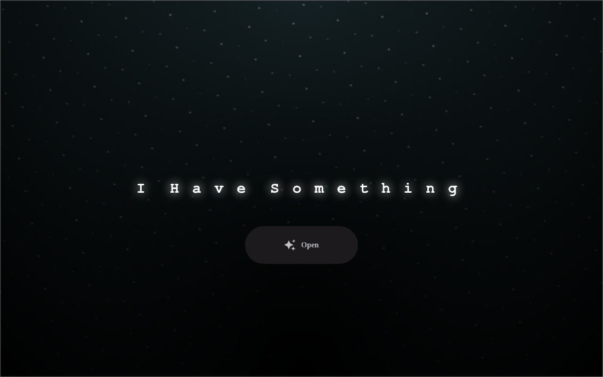
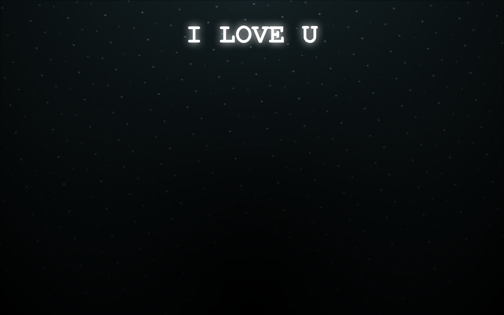

<div align="center">

# 🌸 Flowers for Someone

**A charming, animated web experience for gifting flowers to someone you love.**

Pure HTML, CSS & JavaScript — no frameworks, no build step.

[](https://fiqtor.github.io/flowers-for-someone/)
[](LICENSE)
[](https://github.com/FIQTOR/flowers-for-someone/stargazers)

<br />




<sub>Landing page → click **Open** → a CSS-animated bouquet blooms and types out *I LOVE U*.</sub>

</div>

---

## ✨ What is this?

**Flowers for Someone** is a tiny, self-contained website you can send to someone special. It opens on a quiet, starry night scene with a single glowing button. One click reveals a bouquet built entirely from CSS — petals, stems, leaves and lights — while a message types itself out letter by letter.

No backend. No dependencies. No build tools. Just open it and it works.

## 🎬 How it works

| Step | Page | What happens |
| :--: | :--- | :----------- |
| 1 | `index.html` | Starry night background, glowing **"I Have Something"** title with staggered fade-in, and an **Open** button. |
| 2 | `flower.html` | A bouquet animates into bloom (pure CSS `@keyframes`), then **"I LOVE U"** types out one character at a time. |

## 🛠️ Tech Stack

<p>
  
  
  
  
</p>

- **HTML5** — semantic markup
- **CSS3 / SCSS** — all animation, gradients and the flower itself
- **JavaScript** — the title/typing effects (`js/index.js`, `js/main.js`)

## 🚀 Run locally

```bash
# 1. Clone
git clone https://github.com/FIQTOR/flowers-for-someone.git
cd flowers-for-someone

# 2. Serve (any static server works)
npx serve .
# or: python3 -m http.server 8000
```

Then open <http://localhost:8000> and click **Open**.

> 💡 A local server is recommended over opening `index.html` directly, so the SCSS/CSS and relative asset paths resolve cleanly.

## 📁 Project structure

```
flowers-for-someone/
├── index.html            # landing page ("I Have Something")
├── flower.html           # the animated bouquet + "I LOVE U"
├── css/
│   ├── index.css         # landing page styles
│   └── style.css         # flower animation styles
├── scss/
│   └── style.scss        # source for style.css
├── js/
│   ├── index.js          # staggered title animation
│   └── main.js           # typing effect for the message
├── images/
│   └── gift.png          # favicon
└── docs/                 # README screenshots
```

## 🎨 Customize it

Want to make it yours? A few one-line tweaks:

| What | Where | Change |
| :--- | :--- | :--- |
| The message | `js/main.js` | `('I LOVE U')` → your own text |
| The intro line | `js/index.js` | `I Have Something` → your own text |
| Typing speed | `js/main.js` | the `setTimeout(..., 300)` delay |
| Colors | `scss/style.scss` | recompile to `css/style.css` |

## 🤝 Contributing

Contributions, ideas and forks are welcome! Feel free to open an issue or submit a pull request.

1. Fork the project
2. Create your branch (`git checkout -b feature/amazing-idea`)
3. Commit your changes (`git commit -m 'feat: add amazing idea'`)
4. Push and open a Pull Request

## 📄 License

Released under the [MIT License](LICENSE) — free to use, modify and share.

<div align="center">

Made with ❤️ and a little CSS magic by [FIQTOR](https://github.com/FIQTOR)

</div>
